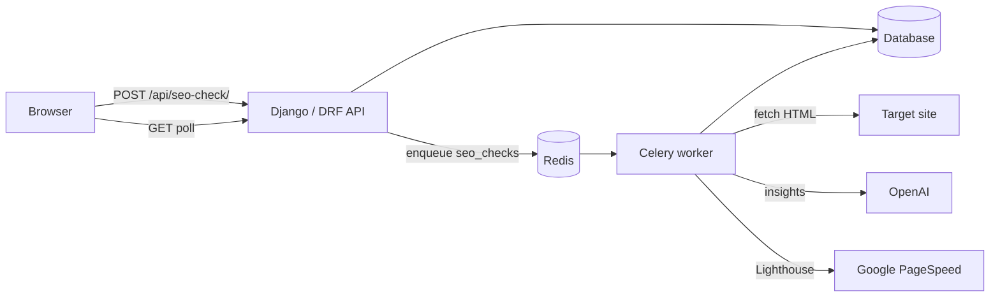

# Web Analysis — SEO Checker

[](https://github.com/FUZAILSOHAIL/SEO_Checker/actions/workflows/ci.yml)


A Django-based technical SEO auditing tool. Paste any URL and get a scored report across 6 categories, with optional AI-powered insights and Google PageSpeed data.

## Screenshot

<!-- PLACEHOLDER: add a real screenshot or GIF of the audit report at docs/screenshot.png.
     Do not commit a generated stand-in. The image below stays broken until that file exists. -->


> **Placeholder.** Save a real capture of the scored report as [`docs/screenshot.png`](docs/screenshot.png) (PNG or GIF). GitHub shows a broken image here until that file is added. See [`docs/README.md`](docs/README.md).

---

## Features

- **Technical SEO audit** across 6 weighted categories (overall score 0–100)
- **AI Insights** — GPT-5.3 analyses page content and suggests improvements
- **PageSpeed Integration** — real Lighthouse scores and Core Web Vitals via Google PSI API
- **Single-page frontend** — no framework, no build step, works out of the box
- **Async processing** — Celery + Redis so the browser polls for results without blocking
- **Rate limiting** — 10 checks/hour per IP via DRF `ScopedRateThrottle`

### SEO Categories

| Category | Weight | What's checked |
|---|---|---|
| 🏷️ Meta Information | 25% | Title, meta description, canonical, robots, lang, viewport, OG tags, Twitter Card |
| 📄 Page Quality | 25% | H1/H2, word count, alt text, text-to-HTML ratio, heading hierarchy |
| 🔗 Page Structure | 20% | URL cleanliness, internal/external links, empty anchors |
| ⚙️ Server Configuration | 20% | HTTPS, status code, response time, redirects, robots.txt, sitemap, HSTS |
| 📊 External Signals | 10% | JSON-LD schema, OG completeness, Twitter Card, favicon |
| ⚡ Performance | advisory | Lighthouse scores, Core Web Vitals (LCP, CLS, FCP, TBT, TTI), CrUX real-user data |
| ✨ AI Insights | advisory | GPT-5.3 executive summary, content score, suggested title/meta, top recommendations |

---

## Stack

- **Backend** — Django 5.0.6 + Django REST Framework 3.15.2
- **Task queue** — Celery 5.4.0 + Redis
- **HTML parsing** — BeautifulSoup4 + lxml
- **HTTP client** — httpx (with SSRF protection)
- **AI** — OpenAI GPT-5.3
- **Performance data** — Google PageSpeed Insights API v5
- **Database** — SQLite (dev) / PostgreSQL (prod)

---

## Architecture

The browser talks only to the Django REST API. Creating a check stores a row and enqueues a job on Redis. A Celery worker fetches the page, runs the analyzers, and — when keys are configured — calls OpenAI and Google PageSpeed. The browser polls until the check is complete. Performance and AI insights are advisory; they do not change the weighted score.



---

## Quick Start

### Prerequisites

- Python 3.11+
- [Docker](https://www.docker.com/products/docker-desktop/) (Redis, or the full Compose stack below)
- Git

### 1. Clone and create a virtual environment

```bash
git clone https://github.com/FUZAILSOHAIL/SEO_Checker.git
cd SEO_Checker
```

#### Linux / macOS

```bash
python3 -m venv .venv
source .venv/bin/activate
pip install -r requirements.txt
cp .env.example .env
```

#### Windows (PowerShell)

```powershell
python -m venv .venv
.venv\Scripts\Activate.ps1
pip install -r requirements.txt --only-binary :all:
Copy-Item .env.example .env
```

### 2. Configure environment

Edit `.env` and fill in your keys. `.env` stays untracked; `.env.example` is the only env file in git.

```dotenv
DJANGO_SECRET_KEY=<generate with: python -c "from django.core.management.utils import get_random_secret_key; print(get_random_secret_key())">

# Required for AI insights
OPENAI_API_KEY=sk-...

# Required for PageSpeed / Core Web Vitals
GOOGLE_PAGESPEED_API_KEY=AIza...
```

For local SQLite instead of the Postgres URL in `.env.example`:

```dotenv
DATABASE_URL=sqlite:///db.sqlite3
```

### 3. Run migrations

Linux / macOS:

```bash
python manage.py migrate
```

Windows (PowerShell):

```powershell
python manage.py migrate
```

### 4. Start all services

#### Linux / macOS

Terminal 1 — Redis:

```bash
docker run -d --name redis-dev -p 6379:6379 redis:7-alpine
```

Terminal 2 — Django (venv activated):

```bash
python manage.py runserver 8080
```

Terminal 3 — Celery (venv activated):

```bash
celery -A config worker -Q seo_checks -l info
```

Stop Redis later with `docker stop redis-dev`. Stop Django and Celery with Ctrl+C in their terminals.

#### Windows (PowerShell)

`start.ps1` and `stop.ps1` are unchanged:

```powershell
.\start.ps1
```

This starts:

- Redis (Docker container `redis-dev` on port 6379)
- Django dev server on `http://127.0.0.1:8080`
- Celery worker (`--pool=solo`, queue: `seo_checks`)

```powershell
.\stop.ps1
```

#### Docker Compose (Linux, macOS, and Windows)

From the repo root, with Docker running:

```bash
docker compose up --build
```

Compose starts three services: `web` (Gunicorn), `celery` (queue `seo_checks`), and `redis`. The app is at `http://127.0.0.1:8080`. The web container runs migrations on startup. SQLite is stored on a shared volume so the worker and the API see the same rows. Gunicorn uses one worker, and Celery uses `--pool=solo`, because that volume is SQLite.

API keys are read from the environment or from a local `.env` (optional). The Compose file's `DJANGO_SECRET_KEY` default is a local placeholder — set your own in `.env` before any shared deployment. For production, use `config.settings.production` and a Postgres `DATABASE_URL`.

```bash
docker compose down
```

### 5. Open the app

```
http://127.0.0.1:8080
```

---

## Testing

Install the dev extras (pytest, pytest-django, ruff) and run the same checks CI runs:

```bash
pip install -r requirements-dev.txt
ruff check .
pytest
```

The suite covers the meta, page quality, page structure, server, external-signals, PageSpeed, and AI analyzers, plus `POST /api/seo-check/` and `GET /api/seo-check/<id>/`. HTTP, OpenAI, and PageSpeed calls are mocked. pytest-socket blocks real sockets, and Django is pointed at an in-memory SQLite database via `config.settings.test`. No API key is required.

---

## API

### `POST /api/seo-check/`

Submit a URL for analysis.

**Request**
```json
{ "url": "https://example.com" }
```

**Response** `201 Created`

The handler stores the row and enqueues Celery. It returns only the new id and the initial status (`pending`). The URL and score are on the poll response, after the worker finishes.

```json
{
  "id": "uuid",
  "status": "pending"
}
```

### `GET /api/seo-check/<id>/`

Poll for results. `status` is `pending`, `running`, `complete`, or `failed`.

**Response** `200 OK` (when `status` is `complete`)
```json
{
  "id": "uuid",
  "url": "https://example.com",
  "final_url": "https://example.com/",
  "status": "complete",
  "overall_score": 84,
  "page_title": "Example Domain",
  "ai_summary": "...",
  "ai_suggestions": {
    "content_quality_score": 82,
    "content_verdict": "good",
    "suggested_title": "",
    "suggested_meta_description": "",
    "top_recommendations": []
  },
  "error_message": "",
  "created_at": "2026-05-21T21:06:00Z",
  "completed_at": "2026-05-21T21:06:12Z",
  "categories": [
    {
      "category": "meta",
      "display_name": "Meta Information",
      "score": 91,
      "checks_data": [
        {
          "id": "title_present",
          "name": "Title Tag",
          "status": "good",
          "value": "Example Domain",
          "description": "Title tag is present.",
          "recommendation": "",
          "points": 15,
          "max_points": 15
        }
      ]
    }
  ]
}
```

---

## Project Structure

```
SEO_Checker/
├── apps/
│   └── seo_checker/
│       ├── analyzers/
│       │   ├── base.py            # Shared Check / CategoryResult dataclasses
│       │   ├── meta.py            # Meta tags analyzer
│       │   ├── page_quality.py    # Content quality analyzer
│       │   ├── page_structure.py  # URL & links analyzer
│       │   ├── server.py          # HTTP / server analyzer
│       │   ├── external_signals.py# Schema & social signals analyzer
│       │   ├── performance.py     # Google PageSpeed Insights analyzer
│       │   └── ai_insights.py     # GPT-5.3 content analyzer
│       ├── models.py              # SeoCheck, CheckCategory models
│       ├── serializers.py         # DRF serializers
│       ├── tasks.py               # Celery task orchestrating all analyzers
│       ├── views.py               # DRF API views (create + poll)
│       └── urls.py
├── config/
│   ├── settings/
│   │   ├── base.py
│   │   ├── development.py
│   │   ├── production.py
│   │   └── test.py                # pytest only
│   ├── celery.py
│   ├── urls.py
│   └── wsgi.py
├── docker/
│   └── entrypoint.sh              # migrate + collectstatic, then exec
├── docs/
│   └── screenshot.png             # placeholder — add a real capture
├── templates/
│   └── seo_checker/
│       └── index.html             # Single-page frontend (vanilla JS)
├── tests/                         # pytest-django, network mocked
├── .github/workflows/ci.yml       # ruff + pytest
├── docker-compose.yml             # web + celery + redis
├── Dockerfile
├── manage.py
├── requirements.txt
├── requirements-dev.txt
├── start.ps1                      # Start Redis + Django + Celery (Windows)
├── stop.ps1                       # Stop all services (Windows)
├── LICENSE
└── .env.example
```

---

## Environment Variables

| Variable | Required | Description |
|---|---|---|
| `DJANGO_SECRET_KEY` | ✅ | Django secret key |
| `DJANGO_SETTINGS_MODULE` | ✅ | e.g. `config.settings.development` |
| `DATABASE_URL` | ✅ | e.g. `sqlite:///db.sqlite3` |
| `REDIS_URL` | ✅ | e.g. `redis://localhost:6379/0` |
| `OPENAI_API_KEY` | optional | Enables AI insights (GPT-5.3) |
| `GOOGLE_PAGESPEED_API_KEY` | optional | Enables PageSpeed / Core Web Vitals |
| `ALLOWED_HOSTS` | ✅ | Comma-separated, e.g. `localhost,127.0.0.1` |

---

## Security Notes

- SSRF protection on all outbound HTTP requests — private/link-local IPs are blocked
- All secrets loaded via `django-environ` — never hardcoded
- Rate limiting: 10 SEO checks per hour per IP
- XSS protection: all dynamic HTML in the frontend is escaped

---

## Windows Notes

- Celery requires `--pool=solo` on Windows (prefork uses shared semaphores that Windows restricts)
- Redis runs via Docker — `start.ps1` handles creating/restarting the container automatically
- Use `;` instead of `&&` to chain commands in PowerShell

---

## License

MIT. Copyright (c) 2026 Fuzail Sohail. See [LICENSE](LICENSE).
